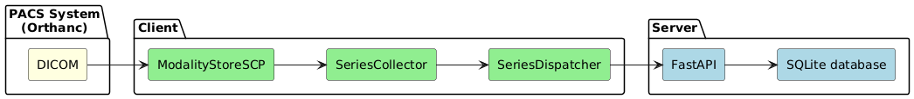
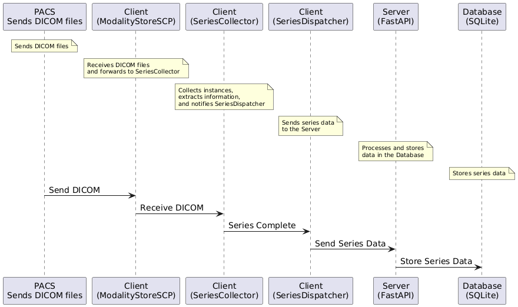

# SW-Engineer-Tech-Challenge

## Overview

This repository contains the needed files for an end-to-end system following a client-server model that receives DICOM files from a PACS, extracts relevant information and stores it in a database.


## Features

- Receive DICOM files from a PACS system
- Extract relevant data from DICOM files using `pydicom`
- Send extracted data to a server via an API
- Store data in a SQLite database
- Simple API for data retrieval
- Comprehensive test suite for validation


## Setup and Installation

### Prerequisites

- Python 3.7 or newer
- Docker

### Dependencies

    
    pip install -r requirements.txt
    

## Set up the PACS system using Docker:

    
    docker run -p 4242:4242 -p 6667:6667 -p 8042:8042 floymedical/pacs_technical_challenge
    


## Running the Server

Start the FastAPI server:

    python server.py
  

## Running the Client


    python client.py


## Running tests:

Tests are contained in test_server.py, run:

    pytest

    
  


## API Endpoints

- **POST /store**
    - **Description**: Stores DICOM series data.
    - **Request Body**: JSON with `SeriesInstanceUID`, `PatientID`, `PatientName`, `StudyInstanceUID`, `InstancesCount`.
    - **Example Request**:
        ```json
        {
            "SeriesInstanceUID": "2.25.265891057852514317505363974980016867097",
            "PatientID": "1",
            "PatientName": "Lehmann^Guido",
            "StudyInstanceUID": "2.25.195279363403791191586079347607892107643",
            "InstancesCount": 17
        }
        ```
    - **Example Response**:
        ```json
        {
            "message": "Series stored successfully"
        }
        ```

- **GET /series**
    - **Description**: Retrieves stored DICOM series data.
    - **Example Request**:
        ```
        curl -X GET "http://127.0.0.1:8000/series"
        ```
    - **Example Response**:
        ```json
        [
            {
                "SeriesInstanceUID": "2.25.265891057852514317505363974980016867097",
                "PatientID": "1",
                "PatientName": "Lehmann^Guido",
                "StudyInstanceUID": "2.25.195279363403791191586079347607892107643",
                "InstancesCount": 17
            }
        ]
        ```

## Architecture

### Component Diagram



### Sequence Diagram

